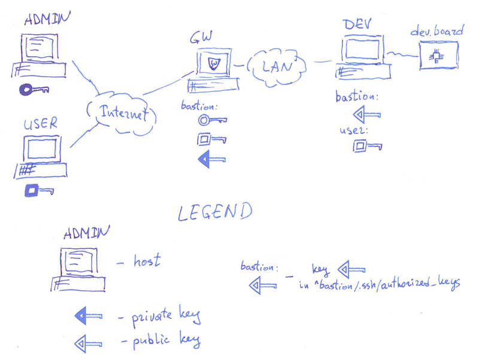

Организация удалённого доступа при помощи bastion
=================================================




Хосты:

  * ADMIN --- рабочее место администратора;
  * USER --- рабочее место пользователя;
  * GW --- маршрутизатор, доступный из Internet;
  * DEV --- рабочий хост, доступ к которому должен получить user; хост DEV непосредственно из Internet недоступен;


Начальная настройка GW
----------------------

0. Заготовить ключ администратора

```
ADMINPUBKEY="ssh-rsa AAAAB3NzaC1yc2EAAAADAQABAAABAQDLCywBhZ8dMiV3Hi6IqYBmZshXrAKZf4wokaxkaPlv9q213VT12dsfA2sdfZJ21sdfsdsadf1233+231rfe123HjYadfwdswHdfsdf23ZnSlCnmkZsafXu3ssadffFDnrAARrWKiVTewqsf3sddfgfd74qwettry323Sq1gfh1hfhg123jhgjfOWxgsjkjkdj3oO0ULn1safzYkklkl1nvzHasfdpqcyutfqTaBWdB55jtfrghjwtygyjhohjCLYhIfCAsgWyBypPy1zfgfht0gpXyWc1m7WAlSVEfzAM3NrBnEPytrByMBRewtI3h19Hg+z+DertNQCwetrJgRrtD admin@ADMIN"
```

На рабочем хосте администратора ADMIN занести в ``~/.ssh/config``:


```
Host bastion-admin
	Hostname <GW IP>
	User bastion
	IdentityFile <PATH-TO-ADMIN-KEY>
	IdentitiesOnly yes
	ForwardX11 no
```


1. Действия на GW

```
USRNAME=bastion
adduser --disabled-password --gecos "" ${USRNAME}
UHD=$(eval echo ~${USRNAME})
( cd ${UHD} && sudo -u ${USRNAME} mkdir .ssh )
( cd ${UHD} && sudo -u ${USRNAME} install -m 600 /dev/null .ssh/authorized_keys )
echo "${ADMINPUBKEY}" >> ${UHD}/.ssh/authorized_keys
( cd ${UHD} && sudo -u ${USRNAME} ssh-keygen -q -t rsa -N '' -f ${UHD}/.ssh/id_rsa 2>/dev/null <<< y >/dev/null )
```

Получили ключ bastion: ``KEYBASTION``.

Разместить скрипт ``bastion`` в домашнем каталоге пользователя bastion на GW.


Добавление нового хоста DEV
---------------------------

На хосте DEV надо сделать пользователя bastion, к которому можно подключаться по ключу ``KEYBASTION``:

```
USRNAME=bastion
PUBKEYBASTION="ssh-rsa AAAAB3NzaC1yc2EAAAADAQABAAABAQDLCywBhZ8dMiV3Hi6IqYBmZshXrAKZf4wokaxkaPlv9q213VT12dsfA2sdfZJ21sdfsdsadf1233+231rfe123HjYadfwdswHdfsdf23ZnSlCnmkZsafXu3ssadffFDnrAARrWKiVTewqsf3sddfgfd74qwettry323Sq1gfh1hfhg123jhgjfOWxgsjkjkdj3oO0ULn1safzYkklkl1nvzHasfdpqcyutfqTaBWdB55jtfrghjwtygyjhohjCLYhIfCAsgWyBypPy1zfgfht0gpXyWc1m7WAlSVEfzAM3NrBnEPytrByMBRewtI3h19Hg+z+DertNQCwetrJgRrtD admin@ADMIN"
adduser --disabled-password --gecos "" ${USRNAME}
UHD=$(eval echo ~${USRNAME})
( cd ${UHD} && sudo -u ${USRNAME} mkdir .ssh )
( cd ${UHD} && sudo -u ${USRNAME} install -m 600 /dev/null .ssh/authorized_keys )
echo "${PUBKEYBASTION}" >> ${UHD}/.ssh/authorized_keys
```

При необходимости на GW в ``~bastion/.ssh/config`` заносим запись для dev, например:


```
Host dev
        Hostname <HOSTNAME>
        Port <PORT>
        User bastion
        IdentityFile ~/.ssh/id_rsa
        IdentitiesOnly yes
        ForwardX11 no
        RequestTTY no
```


Добавление нового пользователя
------------------------------

Предположим, что пользователь будет работать на DEV как пользователь ``user``.

USERPUBKEY --- открытый ключ пользователя


на GW в ``~bastion/.ssh/authorized_keys`` добавляем строчку

```
command="./bastion",no-port-forwarding,no-X11-forwarding,no-agent-forwarding ${USERPUBKEY}
```

на DEV в ``~user/.ssh/authorized_keys добавляем`` строчку

```
${USERPUBKEY}
```

В скрипт bastion заносим правило

```
 	"forward-to")
 		case "${vars[1]}" in
+			"DEV")
+				ssh dev -W localhost:22
+				exit 0
+			;;
 		esac
 
 		exit 0
                ;;
```

На хосте USER в ``~/.ssh/config`` пользователя добавить записи:

```
host bastion
	Hostname <GW IP>
	User bastion
	IdentityFile <PATH-TO-USERKEY>
	IdentitiesOnly yes
	ForwardX11 no

host <HOSTNAME>
	User <USERNAME>
	IdentityFile <PATH-TO-USERKEY>
	ProxyCommand ssh bastion forward-to <HOSTNAME>
```

Где:

  * ``GW IP`` --- имя/адрес хоста GW в Internet;
  * ``HOSTNAME`` условное имя для хоста DEV, в примере выше это dev;

В результате пользователь прозрачно может подключаться к хосту DEV при помощи ``ssh dev``
и копировать туда/оттуда файлы при помощи scp и sftp.


TODO
----

  - [ ] настраивать пользователя bastion на GW автоматически;
  - [ ] генерировать ``~bastion``, ``~bastion/.ssh/config`` и ``~bastion/.ssh/config`` на GW автоматически на основе файлов конфигурации, файлы конфигурации держать под git, как это делает gitolite;
  - [ ] настраивать пользователя bastion на новом хосте DEV автоматически;
  - [ ] добавить учёт "пользователей", чтобы разграничить полномочия;
  - [ ] добавить логгирование;
  - [ ] GW может ходить на все DEV: сделать команду, по которой выводится список DEV и их статус.
